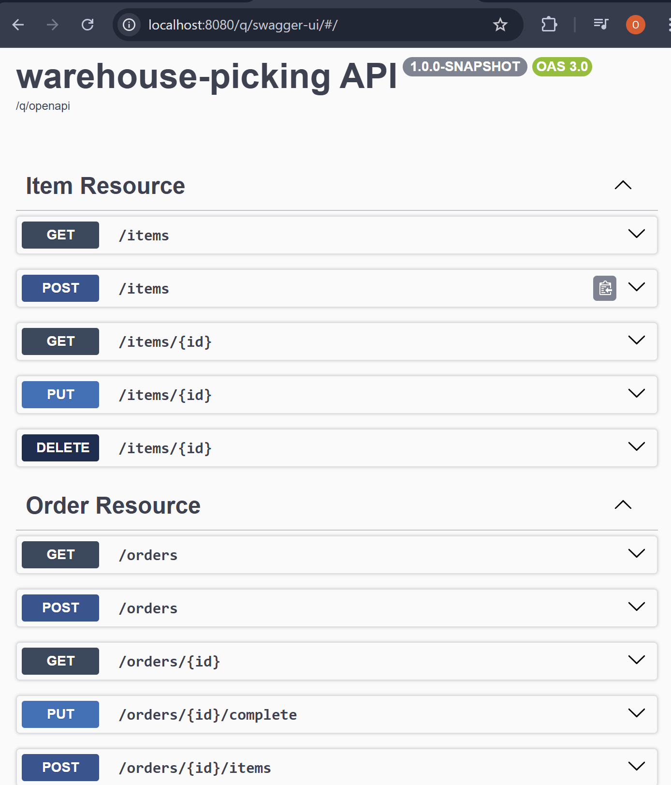

# Warehouse Picking API

## 🚀 Overview

This project is a backend REST API for managing warehouse operations such as items and orders.

It implements a picking workflow where orders go through different states:
**CREATED → IN_PROGRESS → DONE / FAILED**

The system is designed using **Clean Architecture (Hexagonal Architecture)**.

---

## 🛠️ Technologies

* Java
* Quarkus
* JPA / Hibernate
* Maven
* OpenAPI / Swagger

---

## 🧱 Architecture

The project follows Clean Architecture:

* `domain` → business logic (entities, rules)
* `application` → use cases (services)
* `adapters` → REST API + persistence
* `ports` → interfaces

---

## 📦 Features

### Item Management

* Create, update, delete items
* List items (pagination)
* Get item by ID

### Order Management

* Create order
* Add items to order
* Pick items
* Complete order

### Picking Workflow

* CREATED → IN_PROGRESS → DONE / FAILED

---

## 📸 API Preview

Swagger UI showing available endpoints:



---

## ▶️ How to Run

### 1. Build project

mvn clean install

### 2. Configure database

Create your own file:

`src/main/resources/application.properties`

Example:

```
quarkus.datasource.db-kind=mariadb
quarkus.datasource.jdbc.url=jdbc:mariadb://localhost:3306/warehouse
quarkus.datasource.username=your_username
quarkus.datasource.password=your_password
quarkus.hibernate-orm.database.generation=update
```

### 3. Start application

mvn quarkus:dev

### 4. Open Swagger UI

http://localhost:8080/q/openapi

---

## 👨‍💻 My Contribution

* Backend development in Java
* REST API design and implementation
* Business logic for picking workflow
* Clean Architecture implementation

---

## 🚀 Possible Improvements

* Add authentication
* Add frontend
* Improve test coverage
* Containerize application with Docker
